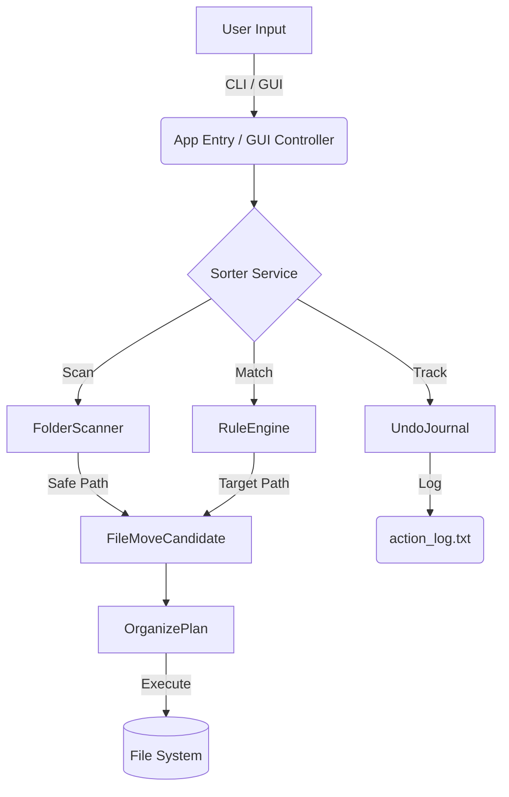

<div align="center">
  <h1>SFORA - Smart File Organizer</h1>
  
  <p>
    An intelligent desktop application for categorizing, deduplicating, and normalizing files automatically using configurable rules and a graphical interface.
  </p>

  <!-- UI Issue 3: Missing Meaningful Badges -->
  <p>
    
    
    
    
  </p>
</div>

<br/>

> [!NOTE]
> This project is designed for users who deal with cluttered download folders, tangled project directories, or massive archival drives. It operates safely in local environments without cloud telemetry.

---

<!-- UI Issue 1: Lack of Navigation / Table of Contents -->
## Table of Contents
<details>
<summary>Click to expand</summary>

- [Motivation](#1-motivation)
- [Prerequisites](#2-prerequisites)
- [Quick Start Guide](#3-quick-start-guide)
- [Screenshots](#4-screenshots)
- [CLI vs. GUI Feature Matrix](#5-cli-vs-gui-feature-matrix)
- [Supported File Types](#6-supported-file-types)
- [Architecture](#7-architecture)
- [Configuration Deep Dive](#8-configuration-deep-dive)
- [Detailed Usage Examples](#9-detailed-usage-examples)
- [Safe Mode and Security](#10-safe-mode--security)
- [Deduplication Algorithm](#11-deduplication-algorithm)
- [Undo Mechanism](#12-undo-mechanism)
- [Performance and Benchmarks](#13-performance--benchmarks)
- [Testing Instructions](#14-testing-instructions)
- [Environment Variables](#15-environment-variables)
- [Error Handling and Logs](#16-error-handling--logs)
- [Build Automation Notes](#17-build-automation-notes)
- [Troubleshooting Guide](#18-troubleshooting-guide)
- [Uninstall and Cleanup](#19-uninstall--cleanup)
- [Data Privacy Statement](#20-data-privacy-statement)
- [Known Limitations](#21-known-limitations)
- [Roadmap](#22-roadmap)
- [Contributing Guidelines](#23-contributing-guidelines)
- [Issue Reporting](#24-issue-reporting)
- [Code of Conduct](#25-code-of-conduct)
- [FAQ](#26-faq)
- [Acknowledgments](#27-acknowledgments)
- [Changelog](#28-changelog)
- [Contact and Maintainer Info](#29-contact--maintainer-info)
- [License](#30-license)

</details>

---

## $\color{#58a6ff}{\\textsf{Motivation}}$
Managing file clutter manually is a tedious, error-prone process. SFORA was built to provide a deterministic, rule-based approach to file management, eliminating the chaos of "Downloads" folders while retaining a safety-first mindset.

## $\color{#58a6ff}{\\textsf{Prerequisites}}$
- **Java Development Kit (JDK) 17** or higher.
- Write permissions to the target directories.

## $\color{#58a6ff}{\\textsf{Quick Start Guide}}$
Get up and running in three steps:

1. **Clone the repo:**
   ```bash
   git clone https://github.com/Ayush-kathil/SFORA-Smart-File-Organizer.git
   cd SFORA-Smart-File-Organizer
   ```
2. **Compile:**
   ```bash
   mkdir bin
   javac -d bin src/*.java
   ```
3. **Run:**
   ```bash
   java -cp bin App
   ```

## $\color{#58a6ff}{\\textsf{Screenshots}}$
*Placeholders for upcoming demonstration media.*

| GUI Mode | CLI Mode |
| :---: | :---: |
|  |  |

## $\color{#58a6ff}{\\textsf{CLI vs. GUI Feature Matrix}}$
| Feature | CLI | GUI |
|---------|:---:|:---:|
| Execute Organize Rules | ✅ | ✅ |
| Preview File Moves | ✅ | ✅ |
| Custom Rules Reload | ✅ | ✅ |
| Find Duplicates | ✅ | ✅ |
| Extract Large Files | ✅ | ✅ |
| Graphical Progress Bar | ❌ | ✅ |
| Interactive Checkboxes | ❌ | ✅ |

## $\color{#58a6ff}{\\textsf{Supported File Types}}$
SFORA handles categorization automatically if rules aren't specified.
<details>
<summary>View Built-in Categories</summary>

- **Documents/Text**: `pdf`, `txt`, `doc`, `docx`, `rtf`, `odt`
- **Documents/Spreadsheets**: `xls`, `xlsx`, `csv`, `tsv`, `ods`
- **Documents/Presentations**: `ppt`, `pptx`, `key`
- **Media/Images**: `jpg`, `jpeg`, `png`, `gif`, `bmp`, `svg`, `webp`, `heic`
- **Media/Audio**: `mp3`, `wav`, `flac`, `m4a`, `aac`, `ogg`
- **Media/Video**: `mp4`, `mkv`, `mov`, `avi`, `webm`
- **Archives/Compressed**: `zip`, `rar`, `7z`, `tar`, `gz`, `bz2`
- **Development/Code**: `java`, `py`, `js`, `ts`, `cpp`, `c`, `h`, `cs`, `go`, `rs`, `html`, `css`, `json`, `xml`, `yml`, `yaml`, `md`, `sql`
- **Installers**: `exe`, `msi`, `apk`, `dmg`, `deb`
</details>

## $\color{#58a6ff}{\\textsf{Architecture}}$
<!-- UI Issue 2: Plain Architecture Diagram -> Mermaid -->


## $\color{#58a6ff}{\\textsf{Configuration Deep Dive}}$
The `rules.txt` file uses a simple key-value parser.
```ini
# Syntax: RULE_TYPE=value, Destination/Folder
KEYWORD=invoice, Documents/Financial
EXTENSION=log, Misc/Logs
```
*Note: Rules are evaluated sequentially. Keywords take precedence over extensions.*

## $\color{#58a6ff}{\\textsf{Detailed Usage Examples}}$
When running in CLI mode, interact with the prompt:
```text
> 1
Organize mode? (type 'rules' or 'hybrid')
> hybrid

--- Confirm Organize ---
Mode: hybrid, Target: C:\Downloads
Moves: 25 files
 - report.pdf -> Documents\Text\report.pdf
Proceed with these moves? (y/n): y
```

## $\color{#58a6ff}{\\textsf{Safe Mode and Security}}$
> [!CAUTION]
> Never run organization scripts blindly on project roots. 

**Safe Mode** is activated by default. `FolderScanner.java` automatically ignores:
- Version Control: `.git`, `.svn`
- IDE Folders: `.idea`, `.vscode`
- Build Folders: `bin`, `build`, `node_modules`
SFORA will *never* organize its own source code.

## $\color{#58a6ff}{\\textsf{Deduplication Algorithm}}$
SFORA uses a cryptographic approach for identifying duplicates:
1. It ignores filenames and timestamps.
2. It generates a **SHA-256 hash** of the file buffer stream.
3. It maps `Hash -> FilePath`. If a hash collision occurs, a duplicate is identified.

## $\color{#58a6ff}{\\textsf{Undo Mechanism}}$
The `UndoJournal.java` logs transactions to `action_log.txt`. 
If you invoke Undo, the system reads the log in reverse, verifies the file exists at the new location, and issues a reverse `Files.move()` operation.

## $\color{#58a6ff}{\\textsf{Performance and Benchmarks}}$
- **Time Complexity**: $O(N)$ for $N$ files during rule matching. Deduplication is $O(N \times S)$ where $S$ is file size (due to hashing).
- **Memory**: $O(1)$ stream buffering ensures large files don't cause `OutOfMemoryError`.

## $\color{#58a6ff}{\\textsf{Testing Instructions}}$
If you want to modify SFORA, run the tests to ensure regressions aren't introduced:
```bash
javac -d bin src/*.java
java -cp bin SforaTests
```

## $\color{#58a6ff}{\\textsf{Environment Variables}}$
Currently, SFORA does not rely on environment variables, relying instead on `rules.txt` in the active working directory.

## $\color{#58a6ff}{\\textsf{Error Handling and Logs}}$
SFORA catches `IOException` during file movements and skips problematic files. Execution reports are appended to `organize_report.txt`.

## $\color{#58a6ff}{\\textsf{Build Automation Notes}}$
SFORA purposely avoids Maven/Gradle to remain a lightweight, single-command compile project. It depends only on `java.base` and `java.desktop`.

## $\color{#58a6ff}{\\textsf{Troubleshooting Guide}}$
- **File Not Moving**: Ensure it isn't locked by another process (e.g., opened in Word).
- **GUI Fails to Load**: Ensure X11/Display servers are running on Linux environments, or launch in CLI mode.

## $\color{#58a6ff}{\\textsf{Uninstall and Cleanup}}$
SFORA is portable. To uninstall:
1. Delete the `SFORA-Smart-File-Organizer` directory.
2. Delete `organize_report.txt`, `rules.txt`, and `action_log.txt` if placed elsewhere.

## $\color{#58a6ff}{\\textsf{Data Privacy Statement}}$
SFORA is 100% offline. It does not phone home, use telemetry, or upload file metadata to any server. 

## $\color{#58a6ff}{\\textsf{Known Limitations}}$
- Network Drives (SMB/NFS) may experience slower deduplication times due to network bottlenecking during hashing.
- Symlinks are currently treated as physical files.

## $\color{#58a6ff}{\\textsf{Roadmap}}$
- [ ] Add parallel streaming for faster folder scanning.
- [ ] Implement a system-tray daemon for real-time monitoring.
- [ ] Support regex in `rules.txt`.

## $\color{#58a6ff}{\\textsf{Contributing Guidelines}}$
1. Fork the repository.
2. Create a feature branch (`git checkout -b feature/AmazingFeature`).
3. Commit your changes (`git commit -m 'Add some AmazingFeature'`).
4. Push to the branch (`git push origin feature/AmazingFeature`).
5. Open a Pull Request.

## $\color{#58a6ff}{\\textsf{Issue Reporting}}$
Found a bug? Open an issue on GitHub with:
- OS version
- Java version
- Steps to reproduce

## $\color{#58a6ff}{\\textsf{Code of Conduct}}$
Please be respectful and constructive in issues and pull requests. Harassment or abusive language will not be tolerated.

## $\color{#58a6ff}{\\textsf{FAQ}}$
**Q: Can I run this on a Mac?**  
A: Yes, it is fully cross-platform (Windows, macOS, Linux).

**Q: Will it delete my files?**  
A: No. SFORA uses `Files.move()` and deduplication only *reports* duplicates without deleting them.

## $\color{#58a6ff}{\\textsf{Acknowledgments}}$
Built utilizing the native power of Java NIO and Swing. 

## $\color{#58a6ff}{\\textsf{Changelog}}$
- **v1.0.0**: Initial Release (Rule matching, Swing GUI, Safe Mode).

## $\color{#58a6ff}{\\textsf{Contact and Maintainer Info}}$
For serious inquiries or support, please open a GitHub Issue or reach out via the repository's author profile.

## $\color{#58a6ff}{\\textsf{License}}$
Distributed under the MIT License. See `LICENSE` (if present) for more information.

---
*Generated with 💻 and ☕.*
<p align="right"><a href="#table-of-contents">⬆ Back to Top</a></p>
